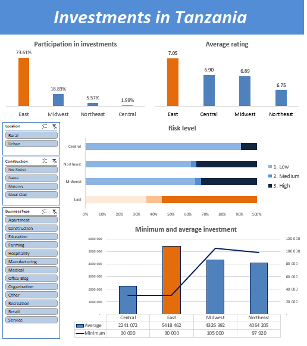

# Investment Patterns in Tanzania #

## 📘 Introduction

This project provides investment patterns across different regions of Tanzania. I explored how capital is distributed, how risk factors such as earthquakes and floods affect investment decisions, and which areas demonstrate the highest performance in terms of average ratings and investment value.

## Dashboard in Excel

## 📌 Strategic Conclusion

The eastern region of Tanzania should be considered a priority investment area due to its concentration of capital, high average investment ratings, and dominant market share accounting for over 73% of all recorded investments.

## 📊 Justification

-  The highest average rating of investments in the country reflects a favorable investment climate and strong performance in the eastern region.

-  The highest average investment value indicates that this region attracts the most capital and large-scale projects.

-  Even the lowest-value investments tend to occur in the eastern or central parts of the country, suggesting that these areas serve as entry points for smaller investors.

## ⚠️ Risk Factors

-  The eastern region also has the highest natural disaster risk. Vver 50% of investments there have been affected by earthquakes or floods.

## ✅ Recommendation

It is recommended to continue or initiate investment activity in eastern Tanzania, while integrating environmental risk factors into portfolio management strategies. Key recommendations include:

-  Implementing risk mitigation mechanisms, such as insurance and geological risk assessments.

-  Diversifying investment portfolios with lower-risk opportunities in the central region.

-  Monitoring the long-term impact of natural disasters on investment ratings and returns.

### Dashboard File

My file is in [Invest pattern in Tanzania](investments_in_tanzania.xlsx).

### Investition in Tanzania Dataset

It includes detailed information on:

- **Location**
- **State**
- **Region**
- **Investment**
- **Construction**
- **BusinessType**
- **Earthquake**
- **Flood**
- **Rating**
- **Risk level**

Raw data:
[data_inv_tanzania](data_inv_tanzania.csv).